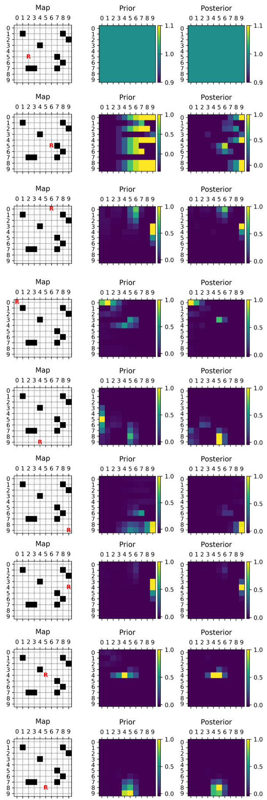

# Markov-Localization

This repository contains an implementation of the markov-localization-algorithm written in python.

To demonstrate its effectiveness, a robot is placed in a map with obstacles. The robot takes 8 steps and with each step, its new position is calculated. In between the steps, the robot is kidnapped and placed at a different location to show the robustnes of the algorithm in such cases.

## Example

The robots steps are the following:

| # | Direction | Measured distance to wall |
| - | --------- | ------------------------- |
| 1 | Right     | 0                         |
| 2 | Up        | 0                         |
| 3 | Left      | 0                         |
| 4 | Down      | 0                         |
| 5 | Right     | 0                         |
| 6 | Top       | 1                         |
| 7 | Left      | 5                         |
| 8 | Down      | 1                         |

After step 4, the robot is kidnapped from position (0,0) to position (6, 4).

Below, the resulting probability-grids as well as the current position of the robot is being shown.

